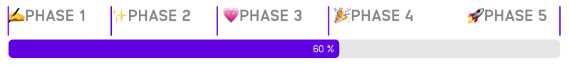

<h1 align="center"> Hi there 👋 welcome on S42 repository</h1>

This project is the direct continuation of the <a href="https://stud42.fr">stud42.fr</a> project. When <a href="https://github.com/42Atomys">@42Atomys</a> (aka. Atom) created stud42, he announced that the project would be open source when he left 42 staff.

4 years later, it's finally time, time to put the project that doesn't need to prove itself anymore in open source, so that this project becomes the project of every student of every campus in the world.

<h3 align="center">Stud42 V3 Open-Source is born :tada: </h3>

Currently in <b>phase 4</b>, the main core of Stud42 is rewritted by <a href="https://github.com/42Atomys">@42Atomys</a>, the S42 version 3 now has a new architecture, a new design, and a new codebase.

## Table of Contents

- [Table of Contents](#table-of-contents)
- [🤯 Mindset of the project](#-mindset-of-the-project)
- [📚 Documentation](#-documentation)
- [📝 Contributing](#-contributing)
- [📜 License](#-license)
- [❤️ Sponsors](#️-sponsors)
- [📫 Contact](#-contact)
- [💬 Discord](#-discord)
- [🎉 Thanks](#-thanks)
- [🤝 Contributors](#-contributors)

## 🤯 Mindset of the project

- **Open Source** : The project is open source, and will always be open source. Any source code is available on this repository, no private code will be added under any circumstances.
- **Community** : The project is made for the community, by the community. Ideas and suggestions are welcome and will be voted by the community.
- **Transparency** : The project is transparent, and will always be transparent. No secrets, no lies, no bullshit. (Except the production credentials :wink:)
- **No commercial tracking, no analytics** : The project is not a business, it is a community project, and it will always be a community project.
- **Education** : The project have to be educational, any code added to the project must be understandable by any student, and must be commented to be learnable by any student on his/her own.

## 📚 Documentation

You can find documentation on all the codebase, each method is commented with its functioning and its utility. In the future, multiple documentations will be available in the `/docs` folder to explain precisely each block of the application.

If you have any question, don't hesitate to join the S42 discord or to enrich the documentation by opening a pull request.

## 📝 Contributing

If you want to contribute to the project, I invite you to read the file [CONTRIBUTING.md](CONTRIBUTING.md) to know how to contribute to the project.

## 📜 License

This project is under the [MIT License](LICENSE). You can use it for your own projects, but you must keep the license file and the credits to the original authors.

## ❤️ Sponsors

If you want to sponsor the project, you can do it by clicking on the button **Sponsor** on the right of the page or going to [https://github.com/sponsors/42Atomys](https://github.com/sponsors/42Atomys). All donations will be used to pay the costs of the project, such as the domain name, the hosting, the SSL certificates, etc.

To thank you for your support, you will have access to the awesomeness part of the app and unique badges on the Discord. You can see the list of all the sponsors and see the list of benefits on the [Sponsors page](https://github.com/sponsors/42Atomys).

## 📫 Contact

If you want to contact me directly, you can do it on [Discord](https://discord.gg/5f864c6hyj) or on my [Twitter](https://twitter.com/42_Atomys).

## 💬 Discord

The Discord is the place to be to share your ideas, to ask for help, to discuss with the community, and to be informed of the latest news about the project.

[Join Discord](https://discord.gg/5f864c6hyj)

## 🎉 Thanks

- **42 Network** : This project is made for the 42 Network, and is made by students of the 42 Network. Many thanks to the 42 network for the opportunity to work on this project and the Network staff for their support.
- **Atomys** : The project is made by Atomys, the creator of Stud42. Many thanks to Atomys for the opportunity to work on this project (self-thanks).
- **The community** : Without your support, the project would not exist. Many thanks to all the people who have supported the project, and who will support the project in the future.
- **The sponsors** : Thanks you a lot for support with your donations, you are awesome 💜

## 🤝 Contributors

List of all the contributors to the project, thanks to you the project is what it is today.

