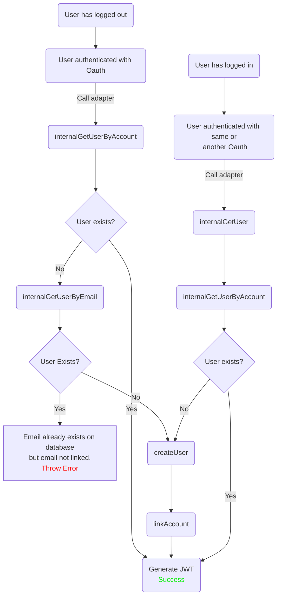
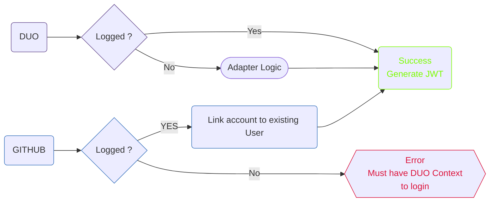

# Next-Auth Stud42 Adapter

To create a custom next-auth adapter, you can follow the documentation: 
https://next-auth.js.org/tutorials/creating-a-database-adapter

In your case we only support OAUTH strategy via JWT and the creation of an User
will be only done when the connection is performed by DUO (42API)

## Complex Adapter logic
To simplify the understanding of Stud42's GraphQL adapter, here is a schema that includes only the functions used by him

## Simplified connection flow
Simplified connection flow with DUO (42API) and Github (works same with others providers)

